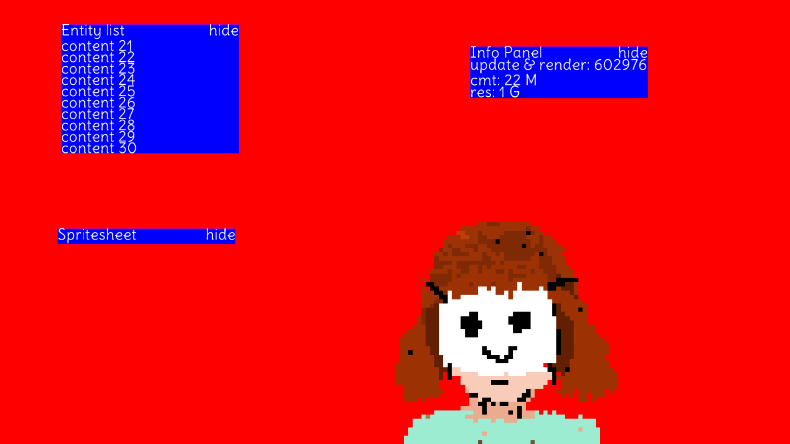

<p>
	<h1 align="center">Desktop GUI Framework</h2>
	<p align="center">Immediate Mode UI, C++, OpenGL</p>
<p align="center">
  
</p>
</p>

## About
I am going to use this when I need a gui front end for my projects.
It uses opengl and only runs on windows for now.

## Build
Right now it builds as a complete app which I treat as a sandbox for testing the UI. After it matures enough, I will provide it as a library and move the sandbox code to a `samples/` folder.

Following arguments can be passed
`platform`, `app`, `clean`, `debug`, `release`, `run`
```
./build.bat debug platform app
```
Binaries built in `out/`

### Tasks
1. Scroll regions
2. ~~Parent / Sibling Hiereachies~~
3. images
4. Basic styling
5. vulkan backend
6. linux / mac backend
